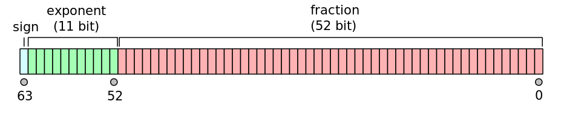

## 简介

### 整数和浮点数

JavaScript 内部，所有数字都是以 64 位浮点数形式储存，即使整数也是如此，也就是说 JavaScript 语言的底层根本没有整数，所有数字都是小数（64 位浮点数）

所以，`1` 与 `1.0` 是相同的，是同一个数

```jsx
1 === 1.0; // true
```

但是，某些运算只有整数才能完成，此时 JavaScript 会自动把 64 位浮点数，转成 32 位整数，然后再进行运算

由于浮点数不是精确的值，所以涉及小数的比较和运算要特别小心

```jsx
0.1 + 0.2 === 0.3;
// false

0.3 /
	0.1(
		// 2.9999999999999996

		0.3 - 0.2
	) ===
	0.2 - 0.1;
// false
```

### 数值精度

根据国际标准 IEEE 754，JavaScript 浮点数的 64 个二进制位，从最左边开始，是这样组成的

- 第 1 位：符号位，`0` 表示正数，`1` 表示负数
- 第 2 位到第 12 位（共 11 位）：指数部分，用来表示次方数
- 第 13 位到第 64 位（共 52 位）：尾数部分，用来表示精度（也称有效数字）

符号位决定了一个数的正负，指数部分决定了数值的大小，小数部分决定了数值的精度



```jsx
(-1)^符号位 * 1.xx...xx * 2^指数部分
```

指数部分一共有 11 个二进制位，因此大小范围就是 0 到 2047

IEEE 754 规定，如果指数部分的值在 0 到 2047 之间（不含两个端点），那么有效数字的第一位默认总是 1，不保存在 64 位浮点数之中

也就是说，有效数字这时总是 `1.xx...xx` 的形式，其中 `xx...xx` 的部分保存在 64 位浮点数之中，最长可能为 52 位

因此，JavaScript 提供的有效数字最长为 53 个二进制位

精度最多只能到 53 个二进制位，这意味着，绝对值小于 2 的 53 次方的整数，即 $-2^{53}$ 到 $2^{53}$，都可以精确表示

```jsx
Math.pow(2, 53);
// 9007199254740992 可以精确显示

Math.pow(2, 53) + 1;
// 9007199254740992 超出范围！
```

### 数值范围

根据标准，64 位浮点数的指数部分的长度是 11 个二进制位，意味着指数部分的最大值是 2047（2 的 11 次方减 1）

也就是说，64 位浮点数的指数部分的值最大为 2047，分出一半表示负数，则 JavaScript 能够表示的数值范围为 $2^{1024}$ 到 $2^{-1023}$（开区间），超出这个范围的数无法表示

如果一个数大于等于 $2^{1024}$ 次方，那么就会发生“正向溢出”，即 JavaScript 无法表示这么大的数，这时就会返回 `Infinity`

```jsx
Math.pow(2, 1024); // Infinity
```

如果一个数小于等于 $2^{-1075}$ 次方（指数部分最小值 -1023，再加上小数部分的 52 位），那么就会发生为“负向溢出”，即 JavaScript 无法表示这么小的数，这时会直接返回 0

```jsx
Math.pow(2, -1075); // 0
```

JavaScript 提供 `Number` 对象的 `MAX_VALUE` 和 `MIN_VALUE` 属性，返回可以表示的具体的最大值和最小值

## 数值的表示法

JavaScript 的数值有两种表示方法

- 字面形式：比如 `35`（十进制）和 `0xFF`（十六进制）
- 科学计数法：
  ```jsx
  123e3; // 123000
  123e-3 - // 0.123
  	3.1e12;
  0.1e-23;
  ```

科学计数法允许字母 `e` 或 `E` 的后面，跟着一个整数，表示这个数值的指数部分

以下两种情况，JavaScript 会自动将数值转为科学计数法表示，其他情况都采用字面形式直接表示

（1）小数点前的数字大于等于 22 位

```jsx
1234567890123456789012; // 1.2345678901234568e+21

123456789012345678901; // 123456789012345680000
```

（2）小数点后的零大于等于 6 个

```jsx
0.0000003; // 3e-7

0.000003; // 0.000003
```

## 数值的进制

使用字面量（literal）直接表示一个数值时，JavaScript 对整数提供四种进制的表示方法：十进制、二进制、八进制、十六进制

- 十进制：没有前导 0 的数值
- 二进制：有前缀 `0b` 或 `0B` 的数值，比如 `0b11`
- 八进制：有前缀 `0o` 或 `0O` 的数值，或者有前导 0、且只用到 0-7 的八个阿拉伯数字的数值，比如 `0o377`
- 十六进制：有前缀 `0x` 或 `0X` 的数值，比如 `0xff`

默认情况下，JavaScript 内部会自动将二进制、八进制、十六进制转为十进制

```jsx
0b11; // 3
0o377; // 255
0xff; // 255
```

如果二进制、八进制、十六进制的数值里面，出现不属于该进制的数字，就会报错

```jsx

0b22 // 报错
0o88 // 报错
0xzz // 报错
```

通常来说，有前导 0 的数值会被视为八进制，但是如果前导 0 后面有数字 `8` 和 `9`，则该数值被视为十进制

```jsx
0888; // 888
0777; // 511
```

前导 0 表示八进制，处理时容易造成混乱
ES5 的严格模式和 ES6，已经废除了这种表示法，但是浏览器为了兼容以前的代码，目前还继续支持这种表示法

## 特殊数值

### 正零和负零

前面说过，JavaScript 的 64 位浮点数之中，有一个二进制位是符号位

这意味着，任何一个数都有一个对应的负值，就连 `0` 也不例外，分为 `+0`，`-0`

几乎所有场合，正零和负零都会被当作正常的 `0`，且它们是等价的

```jsx
+0 - // 0
	0(
		// 0
		-0
	)
		.toString()(
			// '0'
			+0
		)
		.toString() - // '0'
	0 ===
	+0; // true
0 === -0; // true
0 === +0; // true
```

唯一有区别的场合是，`+0` 或 `-0` 当作分母，返回的值是不相等的

```jsx
1 / +0 === 1 / -0; // false
```

上面的代码之所以出现这样结果，是因为除以正零得到 `+Infinity`，除以负零得到 `-Infinity`，这两者是不相等的

### NaN

（1）含义

`NaN` 是 JavaScript 的特殊值，表示“非数字”（Not a Number），主要出现在将字符串解析成数字出错的场合

```jsx
5 - 'x'; // NaN
```

另外，一些数学函数的运算结果会出现 `NaN`

```jsx
0 / 0; // NaN

Math.acos(2); // NaN
Math.log(-1); // NaN
Math.sqrt(-1); // NaN
```

需要注意的是，`NaN` 不是独立的数据类型，而是一个特殊数值，它的数据类型依然属于 `Number`

```jsx
typeof NaN; // 'number'
```

（2）运算规则

`NaN` 不等于任何值，包括它本身

```jsx
NaN === NaN; // false
```

数组的 `indexOf` 方法内部使用的是严格相等运算符，所以该方法对 `NaN` 不成立

```jsx
[NaN].indexOf(NaN); // -1
```

`NaN` 在布尔运算时被当作 `false`

```jsx
Boolean(NaN); // false
```

`NaN` 与任何数（包括它自己）的运算，得到的都是 `NaN`

```jsx
NaN + 32; // NaN
NaN - 32; // NaN
NaN * 32; // NaN
NaN / 32; // NaN
```

### Infinity

（1）含义

`Infinity` 表示“无穷”，用来表示两种场景。一种是一个正的数值太大（`+Infinity`），或一个负的数值太小（`-Infinity`），无法表示；另一种是非 0 数值除以 0，得到 `Infinity`

```jsx
// 场景一
Math.pow(2, 1024); // Infinity

// 场景二
0 / 0; // NaN
1 / 0; // Infinity
```

（2）运算规则

`Infinity` 大于一切数值（除了 `NaN`），`-Infinity` 小于一切数值（除了 `NaN`）

`Infinity` 与 `NaN` 比较，总是返回 `false`

```jsx
Infinity >
	1000 - // true
		Infinity <
	-1000; // true

Infinity > NaN; // false
```

`Infinity` 的四则运算，符合无穷的数学计算规则

但 0 做相乘计算时，会有差别，返回 `NaN`

```jsx
5 + Infinity; // Infinity
5 - Infinity; // -Infinity
5 * Infinity; // Infinity
Infinity / 5; // Infinity
5 / Infinity; // 0

0 * Infinity; // NaN
```

`Infinity` 与 `Infinity` 计算

```jsx
Infinity + Infinity; // Infinity
Infinity * Infinity; // Infinity
Infinity - Infinity; // NaN
Infinity / Infinity; // NaN
```

## 与数值相关的全局方法

### parseInt()

（1）基本用法

`parseInt` 方法用于将字符串转为整数

```jsx
parseInt('123'); // 123
```

如果字符串头部有空格，空格会被自动去除

```jsx
parseInt('   81'); // 81
```

如果 `parseInt` 的参数不是字符串，则会先转为字符串再转换

```jsx
parseInt(1.23); // 1
// 等同于
parseInt('1.23'); // 1
```

字符串转为整数的时候，是一个个字符依次转换，如果遇到不能转为数字的字符，就不再进行下去，返回已经转好的部分

```jsx
parseInt('8a'); // 8
parseInt('12**'); // 12
```

如果字符串的第一个字符不能转化为数字（后面跟着数字的正负号除外），返回 `NaN`

```jsx
parseInt('abc'); // NaN
parseInt('.3'); // NaN
parseInt(''); // NaN
parseInt('+'); // NaN
parseInt('+1'); // 1
```

所以，`parseInt` 的返回值只有两种可能，要么是一个十进制整数，要么是 `NaN`

如果字符串以 `0x` 或 `0X` 开头，`parseInt`会将其按照十六进制数解析

```jsx
parseInt('0x10'); // 16
```

如果字符串以 `0` 开头，将其按照十进制解析

```jsx
parseInt('011'); // 11
```

对于那些会自动转为科学计数法的数字，`parseInt` 会将科学计数法的表示方法视为字符串，因此导致一些奇怪的结果

```jsx
parseInt(1000000000000000000000.5); // 1
// 等同于
parseInt('1e+21'); // 1

parseInt(0.0000008); // 8
// 等同于
parseInt('8e-7'); // 8
```

（2）进制转换

`parseInt` 方法还可以接受第二个参数（2 到 36 之间），表示被解析的值的进制，返回该值对应的十进制数。默认情况下，`parseInt` 的第二个参数为 10

```jsx
parseInt('1000'); // 1000
// 等同于
parseInt('1000', 10); // 1000
```

下面是转换指定进制的数的例子

```jsx
parseInt('1000', 2); // 8
parseInt('1000', 6); // 216
parseInt('1000', 8); // 512
```

如果第二个参数不是数值，会被自动转为一个整数。这个整数只有在 2 到 36 之间，才能得到有意义的结果，超出这个范围，则返回 `NaN`。如果第二个参数是 `0`、`undefined`和`null`，则直接忽略

```jsx
parseInt('10', 37); // NaN
parseInt('10', 1); // NaN
parseInt('10', 0); // 10
parseInt('10', null); // 10
parseInt('10', undefined); // 10
```

如果字符串包含对于指定进制无意义的字符，则从最高位开始，只返回可以转换的数值。如果最高位无法转换，则直接返回 `NaN`

```jsx
parseInt('1546', 2); // 1
parseInt('546', 2); // NaN
```

前面说过，如果 `parseInt` 的第一个参数不是字符串，会被先转为字符串。这会导致一些令人意外的结果

```jsx
parseInt(011, 2); // NaN

// 等同于
parseInt(String(011), 2);

// 等同于
parseInt(String(9), 2);
```

### parseFloat()

`parseFloat` 方法用于将一个字符串转为浮点数

```jsx
parseFloat('3.14'); // 3.14
```

如果字符串包含不能转为浮点数的字符，则不再进行往后转换，返回已经转好的部分（同 `parseInt`）

```jsx
parseFloat('3.14more non-digit characters'); // 3.14
```

`parseFloat` 方法会自动过滤字符串前面的空格（同 `parseInt`）

```jsx
parseFloat('\t\v\r12.34\n '); // 12.34
```

如果参数不是字符串，则会先转为字符串再转换（同 `parseInt`）

```jsx
parseFloat([1.23]); // 1.23
// 等同于
parseFloat(String([1.23])); // 1.23
```

如果字符串的第一个字符不能转化为浮点数，则返回 `NaN`（同 `parseInt`）

```jsx
parseFloat([]); // NaN
parseFloat('FF2'); // NaN
parseFloat(''); // NaN
```

如果字符串符合科学计数法，则会进行相应的转换（不同 `parseInt`）

```jsx
parseInt(1e21); // 1
parseFloat(1e21); // 1e+21
```

### isNaN()

`isNaN` 方法可以用来判断一个值是否为 `NaN`

```jsx
isNaN(NaN); // true
isNaN(123); // false
```

但是，`isNaN` 只对数值有效，如果传入其他值，会被先转成数值，也就是说，`isNaN` 为 `true` 的值，有可能不是 `NaN`，而是一个字符串

```jsx
isNaN('Hello'); // true
// 相当于
isNaN(Number('Hello')); // true
```

但是，对于空数组和只有一个数值成员的数组，`isNaN` 返回 `false`，原因是这些数组能被 `Number` 函数转成数值

```jsx
isNaN([]); // false
isNaN([123]); // false
isNaN(['123']); // false
```

因此，使用 `isNaN` 之前，最好判断一下数据类型

```jsx
function myIsNaN(value) {
	return typeof value === 'number' && isNaN(value);
}
```

判断 `NaN` 更可靠的方法是，利用 `NaN` 为唯一不等于自身的值的这个特点，进行判断

```jsx
function myIsNaN(value) {
	return value !== value;
}
```

### isFinite()

`isFinite` 方法返回一个布尔值，表示某个值是否为正常的数值

除了`Infinity`、`-Infinity`、`NaN` 和 `undefined` 这几个值会返回`false`，`isFinite`对于其他的数值都会返回`true`

```jsx
isFinite(Infinity); // false
isFinite(-Infinity); // false
isFinite(NaN); // false
isFinite(undefined); // false

isFinite(null); // true
isFinite(-1); // true
```

如果 `isFinite` 的参数不是数值，则会先转为数值再转换

```jsx
isFinite(true); // true

// 等同于
isFinite(Number(true));

// 等同于
isFinite(0);
```
